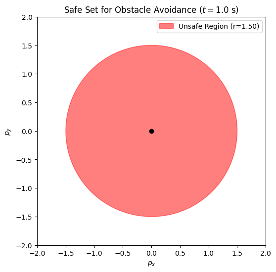

This repository is a modified version of the [DeepReach](https://github.com/smlbansal/deepreach/tree/a8127aa7825d58623e9646211644876c83dd71d0?tab=readme-ov-file) codebase by the Safe and Intelligent Autonomy Lab, featuring a 2-dimensional robot example.

## Table of Contents
* [Intuition on Reachability for a Planar Robot](#intuition-on-reachability-for-a-planar-robot)
* [Hamiltonian Construction](#hamiltonian-construction)
* [Modifications to DeepReach](#modifications-to-deepreach)
* [Experiments and Results](#experiments-and-results)
* [References](#references)

## Intuition on Reachability for a Planar Robot

We consider a planar autonomous robot whose state $x=(p_x, p_y)$ evolves as:

$$
\dot p_x = v \cos\theta, \quad \dot p_y = v \sin\theta
$$

with constant speed $v = 1$ m/s and direct control of the heading $\theta \in [-\pi, \pi]$. Unlike systems with angular rate control, this robot can **instantaneously** choose any heading $\theta$ at any time.

---

### Cases Considered

We analyze three cases over a time horizon $T = 1$ s:

1. **BRT for Obstacle Avoidance**: An obstacle of radius 0.5m is at the origin. Compute the set of initial states from which collision is unavoidable.
2. **Safe Set for Obstacle Avoidance**: An obstacle of radius 0.5m is at the origin. Compute the set of initial states from which the robot is guaranteed to avoid the obstacle.
3. **BRT for Goal Reachability**: A goal of radius 0.25m is at the origin. Compute the set of initial states from which the robot can reach the goal.


The system is considered to have "reached" a target if it reaches **any point within a circle** of the given radius.

---

### Notation

We define the circle of center $c = (x, y)$ and radius $r$ as:

```math
C(c, r) = \{ p \in \mathbb{R}^2 \mid \|p - c\| \leq r \}
```

Note: While the term "circle" traditionally refers to points on the circumference, I use $C(c, r)$ to represent all points **within and on** the boundary (the closed region of radius $r$ centered at $c$). 

This is used in this section to represent goal regions, obstacles, and reachable sets.

---

### 1. BRT for Obstacle Avoidance

**Definition:**  
The Backward Reachable Tube (BRT) in this case is the set of initial states from where the system **cannot avoid** hitting the obstacle within the given time horizon, even with optimal control.

**Observation:**  
The robot has the ability to directly and instantaneously control its heading $\theta$.  
This means that even in extreme cases, e.g. starting on the boundary of the obstacle and heading toward it, the robot can immediately change its direction to avoid the obstacle.  

Thus, the only **unsafe** states are those **already inside** the obstacle at $t=0$.

### Therefore:

For all $t = 0$, $0.5$, and $1.0$ s:

$$
\text{BRT}_{t} = C\left((0, 0),\, 0.5\right)
$$

#### Visualization 

| $t = 0s$ | $t = 0.5s$ | $t = 1.0s$ |
|:--------:|:-----------:|:-----------:|
|  |   |    |

---

### 2. Safe Set for Obstacle Avoidance

**Definition:**  
The **safe set** is the set of initial states from which the robot is guaranteed to **never enter** the obstacle region, regardless of the control input (i.e., no matter how $\theta$ is chosen over time).

#### Derivation

1. The robot can move up to a distance of $vT$ in time $T$.

2. So, starting from state $x$, the reachable region within time $T$ is:

```math
C(x, vT)
```

3. A collision is possible if the circle of radius \(vT\) around \(x\) and the obstacle circle of radius \(r_o\) around the origin **overlap**. Two circles of radii \(R\) and \(r\) overlap if and only if the distance between their centers is at most \(R + r\).

```math
\|x - (0,0)\| \;\le\; vT + r_o
\quad\Longleftrightarrow\quad
\|x\|\;\le\;vT + r_o.
```

4. The safe set is the complement of the above:

```math
\mathcal{S}_T = \left\{ x \mid \|x\| > vT + r_o \right\}
```

5. Substituting $v = 1$, $r_o = 0.5$:

```math
\mathcal{S}_T = \left\{ x \mid \|x\| > T + 0.5 \right\}
```

#### Interpretation

At each time point, the safe set excludes a circle centered at the origin with radius $T + 0.5$, i.e., radius 0.5, 1, and 1.5 at times 0s, 0.5s, and 1s respectively.

#### Visualization 

| $t = 0s$ | $t = 0.5s$ | $t = 1.0s$ |
|:--------:|:-----------:|:-----------:|
|  |  |   |

---

### 3. BRT for Goal Reachability

**Definition:**  
This BRT is the set of initial states from which the robot **can reach** a goal region within the time horizon $T$.

#### Derivation

1. Reachable region from state $x$ in time $T$ is again:

```math
C(x, vT)
```

2. The robot can **reach** the goal centered at the origin with radius $ r_g $ if the reachable region from $ x $ overlaps with the goal region. Two circles overlap if and only if the distance between their centers is at most the sum of their radii:

```math
\|x\| \leq vT + r_g
```

4. Therefore, the BRT for reaching the goal is:

```math
\text{BRT}_T = C\left((0, 0),\, vT + r_g\right)
```

5. Substituting $v = 1$, $r_g = 0.25$:

```math
\text{BRT}_T = C\left((0, 0),\, T + 0.25\right)
```

#### Interpretation
At each time point, the BRT includes a circle centered at the origin with radius $T + 0.25$, i.e., radius 0.25, 0.75, and 1.25 at times 0s, 0.5s, and 1s respectively.

#### Visualization 

| $t = 0s$ | $t = 0.5s$ | $t = 1.0s$ |
|:--------:|:-----------:|:-----------:|
|  |  |   |


## Hamiltonian Construction
We consider a robot with constant speed $v$ and controllable heading $\theta$. The dynamics, state, and control are:

```math
\dot p_x = v\cos\theta, \quad \dot p_y = v\sin\theta, \quad x = (p_x, p_y), \quad u = \theta \in [-\pi,\pi].
```

**Spatial Gradient Notation:** Define the spatial gradient of the value function $V(x, t)$ as:

```math
\nabla V(x) = \begin{pmatrix} V_x \\ V_y \end{pmatrix},
\quad V_x = \frac{\partial V}{\partial p_x}, \; V_y = \frac{\partial V}{\partial p_y}.
```

---

### Avoid Case

**Hamiltonian:**
```math
H_{\mathrm{avoid}}(x, t)
= \max_{\theta\in[-\pi,\pi]} \nabla V\cdot f(x,\theta)
= v \max_{\theta}\bigl(V_x\cos\theta + V_y\sin\theta\bigr).
```

Let \(a=V_x\), \(b=V_y\).  Then, the maximum value is given by [[1]](#references):

```math
\max_{\theta}(a\cos\theta + b\sin\theta)
= \sqrt{a^2 + b^2},
```

so

```math
H_{\mathrm{avoid}} = v\sqrt{V_x^2 + V_y^2}.
```

**Optimal control**:

Differentiate the inner term w.r.t. $\theta$ and equate to 0:

```math
\frac{d}{d\theta}(a\cos\theta + b\sin\theta)
= -a\sin\theta + b\cos\theta = 0
\quad\Longrightarrow\quad
\theta^* = arctan(b, a).
```

---

### Reach Case

**Hamiltonian**:

```math
H_{\mathrm{reach}}(x,\nabla V)
= \min_{\theta\in[-\pi,\pi]} \nabla V\cdot f(x,\theta)
= v \min_{\theta}(V_x\cos\theta + V_y\sin\theta)
= -v\sqrt{V_x^2 + V_y^2}.
```

**Optimal control**:

The minimum is attained by choosing the heading exactly opposite to the one that maximizes it.

$\theta^* = arctan(b, a) + \pi$.

---

## Modifications to DeepReach

The codebase introduces `PlanarRobot2D` with the following implemented functions:
* `__init(self, ...)__`
* `state_test_range(self)`
* `dsdt(self, state, control, disturbance)`
* `boundary_fn(self, state)`
* `hamiltonian(self, state, dvds)`
* `plot_config(self)`

_NOTE_: : The codebase is originally designed to support 3D visualizations by requiring a `z_axis_idx`. For 2D systems, the tutorial suggests setting `z_axis_idx` = -1. However, this approach duplicates the same axis (e.g., Y) for Z. To handle 2D systems, the validate function has been updated to support them explicitly by generating a 3×1 grid of plots (varying only over time, not over a third spatial axis).

---

## Experiments and Results

The commands used to conduct the three experiments and the corresponding plots are provided below. Due to limitations in GPU availability within the Google Colaboratory environment, the number of iterations for curriculum learning was reduced to 40,000 from the intended 100,000.

The experiments are available in the `notebooks/` directory as Jupyter notebooks with outputs.

1. BRT for Obstacle Avoidance
```
python run_experiment.py --mode train --experiment_class DeepReach --dynamics_class PlanarRobot2D --experiment_name brt_obstacle_05m --minWith target --goalR 0.5 --velocity 1.0 --set_mode avoid
```


The results of the experiment align with the intuition above. At each time point, the BRT is a disc of radius 0.5 centered at the origin.

2. Safeset for Obstacle Avoidance
```
python run_experiment.py --mode train --experiment_class DeepReach --dynamics_class PlanarRobot2D --experiment_name brt_obstacle_05m --minWith target --goalR 0.5 --velocity 1.0 --set_mode reach
```


The results of the experiment align with the intuition above. At each time point, the BRT is a disc of radius $T + 0.5$ centered at the origin.

3. BRT for Goal Reachability
```
python run_experiment.py --mode train --experiment_class DeepReach --dynamics_class PlanarRobot2D --experiment_name brt_obstacle_05m --minWith target --goalR 0.25 --velocity 1.0 --set_mode reach
```


The results of the experiment align with the intuition above. At each time point, the BRT is a disc of radius $T + 0.25$ centered at the origin.


## References
1. https://math.stackexchange.com/questions/946877/if-y-a-sinx-b-cosx-c-then-find-maxima-and-minima-for-y
